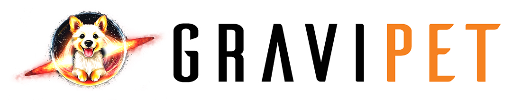

# GraviPet.jl

GraviPet is the **G**eneral **R**elativistic **A**strophysics
**V**isualization, **I**nitialization, and **P**ostprocessing
**E**fficient **T**oolkit.

* 
* 
* 

## Acknowledgements

The GraviPet logo was created by [Grabriela
Secara](https://perimeterinstitute.ca/people/gabriela-secara) at the
[Perimeter Institute for Theoretical
Physics](https://perimeterinstitute.ca/).
